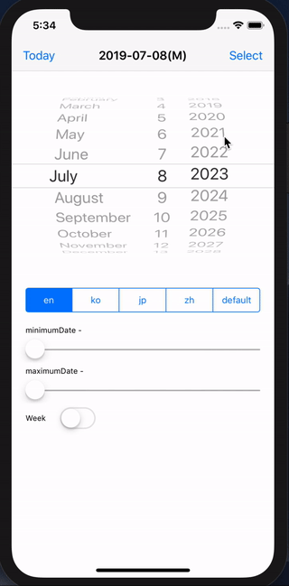

# CalendarPicker

[](https://travis-ci.org/pikachu987/CalendarPicker)
[](https://cocoapods.org/pods/CalendarPicker)
[](https://cocoapods.org/pods/CalendarPicker)
[](https://cocoapods.org/pods/CalendarPicker)

[](https://developer.apple.com/swift/)


## Introduce

I have added some features in the iOS default DatePicker.

## Preview



## Requirements

`CalendarPicker` written in Swift 5.0. Compatible with iOS 8.0+

## Installation

CalendarPicker is available through [CocoaPods](https://cocoapods.org). To install
it, simply add the following line to your Podfile:

```ruby
pod 'CalendarPicker'
```

### Usage


```swift
import CalendarPicker
```

```swift
let calendarPicker = CalendarPicker()
```

### Property

DateFormatType

```swift
calendarPicker.dateFormatType = .default
calendarPicker.dateFormatType = .yearMonth
```

Locale

```swift
calendarPicker.localeType = .en
calendarPicker.localeType = .ko
calendarPicker.localeType = .jp
calendarPicker.localeType = .zh
calendarPicker.localeType = .default
```

Date

```swift
calendarPicker.date = Date()
print(calendarPicker.selectedDateComponent)
```

minimum & maximum

```swift
calendarPicker.minimumDate = Date()
calendarPicker.maximumDate = Date()
```

Show Week

```swift
calendarPicker.isShowWeek = true
```

Colors

```swift
calendarPicker.textColor = .black
calendarPicker.saturdayColor = .blue
calendarPicker.sundayColor = .red
```

Font

```swift
calendarPicker.font = UIFont.systemFont(ofSize: 23)
```

### Function

```swift
calendarPicker.update(animated: true)
calendarPicker.setDate(Date(), animated: true)
```

### Delegate

```swift

class ViewController: UIViewController{
    override func viewDidLoad() {
        super.viewDidLoad()

        let calendarPicker = CalendarPicker()
        calendarPicker.delegate = self
    }
}

// MARK: CalendarPickerDelegate
extension ViewController: CalendarPickerDelegate {
    func calendarPickerSelectDate(_ dateCompontnt: DateComponent) {

    }
}

```

## Author

pikachu987, pikachu77769@gmail.com

## License

CalendarPicker is available under the MIT license. See the LICENSE file for more info.
